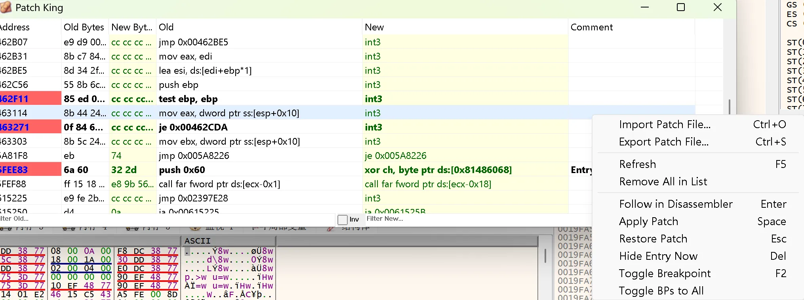

# Patch King Plugin for x64dbg



**Patch King** is a powerful patch management plugin for x64dbg, designed to replicate and enhance the "Patches" window functionality from OllyDbg. It allows reversers to easily view, manage, filter, and export patches within the x64dbg environment.

## Key Features

### 1. Advanced Patch Listing
*   **OllyDbg-Style View**: Clean, list-based display of all patches.
*   **Columns**: Address, Old Bytes, New Bytes, Original Disassembly, New Disassembly, and Comments.
*   **Real-time Disassembly**: Dynamically disassembles modified bytes to show the new instruction.

### 2. Intelligent Auto-Comments
*   **Smart Resolution**: Automatically fetches comments from the debugger.
*   **String References**: Resolves operand addresses (e.g., `push 0x402000`) to their string values (e.g., `"Game Over"`) or labels.
*   **Encoding Support**: Correctly handles Chinese and Unicode characters in comments.

### 3. Powerful Filtering
*   **Regex Support**: Filter patches by Old Instruction, New Instruction, or Comments using Regular Expressions.
*   **Dual Filters**: Separate input boxes for "Old" and "New" state filtering.
*   **Search**: quickly isolate specific patches or patterns.

### 4. Patch Management Commands
*   **Apply/Restore**: Quickly toggle individual patches on or off.
*   **Batch Operations**: 
    *   **Toggle BPs to All**: Set breakpoints on all currently visible/filtered patches.
    *   **Remove All**: Clear the list (hide entries).
*   **Follow in Disassembler**: Jump directly to the patch address in the CPU view.

### 5. Import / Export
*   **Save/Load**: Export your patches to a file and reload them later, perfect for sharing or saving progress.
*   **Format**: Supports parsing standard patch formats.

## Shortcuts

| Key | Action |
| :--- | :--- |
| **F5** | Refresh Patch List |
| **Space** | Apply Patch (Enable) |
| **Esc** | Restore Original Bytes (Disable) |
| **F2** | Toggle Breakpoint |
| **Del** | Hide Entry from List |
| **Enter** | Follow in Disassembler |
| **Ctrl+S** | Export Patches |
| **Ctrl+O** | Import Patches |

## Installation

1.  Copy `PatchPlugin.dp32` (for x32dbg) or `PatchPlugin.dp64` (for x64dbg) to the `release` or `plugins` folder of your x64dbg installation.
2.  Start x64dbg.
3.  Access the plugin via the **Plugins** menu -> **Patch King** -> **Open Patch Window** (or via icon if available).

## Build Instructions

Built with Visual Studio 2022 and MSBuild.

```bash
# Build for x86 (x32dbg)
msbuild PatchPlugin.vcxproj /p:Configuration=Release /p:Platform=Win32

# Build for x64 (x64dbg)
msbuild PatchPlugin.vcxproj /p:Configuration=Release /p:Platform=x64
```
